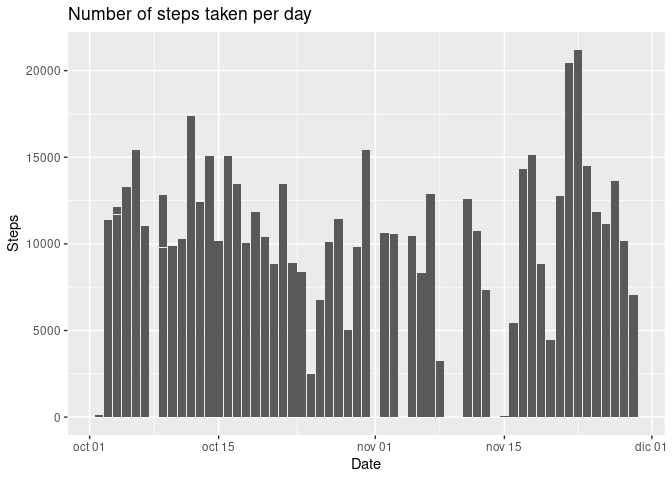
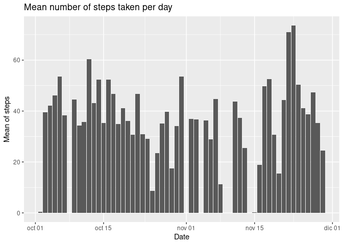
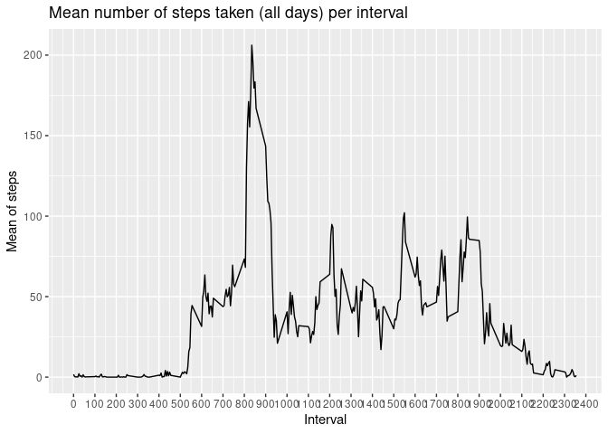
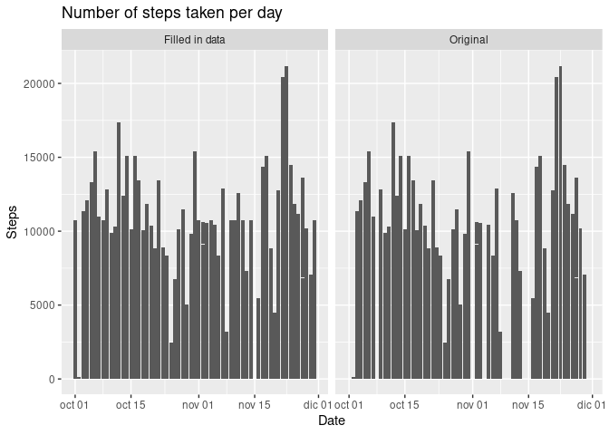
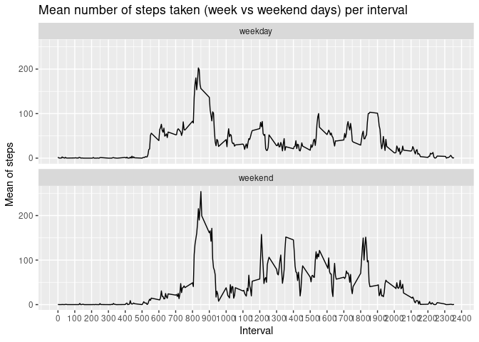

# Data

The [data](https://d396qusza40orc.cloudfront.net/repdata%2Fdata%2Factivity.zip) for this assignment has been downloaded from the course web site on 2022-15-12.

The variables included in this dataset are:

-   steps: Number of steps taking in a 5-minute interval (missing values are coded as NA)
-   date: The date on which the measurement was taken in YYYY-MM-DD format
-   interval: Identifier for the 5-minute interval in which measurement was taken

There are a total of 17,568 observations.

# Loading and preprocessing the data {#loading-and-preprocessing-the-data}

Loading the data through a direct call to `read.csv`. After checking the data and the *type* of each column I *cast* `data$date` into `date`.


```r
data <- read.csv("DATA/activity.csv")
str(data)
```

```
## 'data.frame':	17568 obs. of  3 variables:
##  $ steps   : int  NA NA NA NA NA NA NA NA NA NA ...
##  $ date    : chr  "2012-10-01" "2012-10-01" "2012-10-01" "2012-10-01" ...
##  $ interval: int  0 5 10 15 20 25 30 35 40 45 ...
```

```r
data$date <- as.Date(data$date)
summary(data)
```

```
##      steps             date               interval     
##  Min.   :  0.00   Min.   :2012-10-01   Min.   :   0.0  
##  1st Qu.:  0.00   1st Qu.:2012-10-16   1st Qu.: 588.8  
##  Median :  0.00   Median :2012-10-31   Median :1177.5  
##  Mean   : 37.38   Mean   :2012-10-31   Mean   :1177.5  
##  3rd Qu.: 12.00   3rd Qu.:2012-11-15   3rd Qu.:1766.2  
##  Max.   :806.00   Max.   :2012-11-30   Max.   :2355.0  
##  NA's   :2304
```

# Mean total number of steps taken per day

*For this part of the assignment, I will ignore the missing values in the dataset.*

The following is an histogram of the total number of steps taken each day. *Cleaned of NA items.*


```r
ggplot(data = subset(data, !is.na(data$steps))) + 
  geom_col(aes(x = date, y = steps)) + 
  labs(
    title = "Number of steps taken per day", 
    x = "Date", 
    y = "Steps")
```

<!-- -->

This code calculates and reports the mean and median total number of steps taken per day.


```r
mean_steps_day <- aggregate(
  x = data$steps,
  by = list(Date = data$date),
  FUN = mean,
  na.rm = TRUE)

median_steps_day <- aggregate(
  x = data$steps,
  by = list(Date = data$date),
  FUN = median,
  na.rm = TRUE)
```

As we have seen [above](#loading-and-preprocessing-the-data), the *median* for `data$steps` is 0 for the whole dataset. We can confirm that is the case too for all medians calculated per day:


```r
summary(median_steps_day$x)
```

```
##    Min. 1st Qu.  Median    Mean 3rd Qu.    Max.    NA's 
##       0       0       0       0       0       0       8
```

So, I will only represent the mean number of steps taken per day.


```r
ggplot(data = subset(mean_steps_day, !is.na(mean_steps_day$x))) +
  geom_col(aes(x = Date, y = x)) +
  labs(
    title = "Mean number of steps taken per day", 
    y = "Mean of steps")
```

<!-- -->

# Average daily activity pattern

This time series plot shows the average number of steps taken, across all days (*y-axis*) per 5-minute interval (*x-axis*).


```r
mean_steps_interval <- aggregate(
  x = data$steps,
  by = list(Interval = data$interval),
  FUN = mean,
  na.rm = TRUE)

ggplot(data = mean_steps_interval) +
  geom_line(aes(Interval, x)) +
  scale_x_continuous(breaks = seq(0,2400,100)) +
  labs(
    title = "Mean number of steps taken (all days) per interval", 
    y = "Mean of steps")
```

<!-- -->

The 5-minute interval containing the maximum number of steps[^1] is 835 (`mean_steps_interval[which.max(mean_steps_interval$x),1]`).

[^1]: On average across all the days in the dataset.

# Inputing missing values

As seen in the [summary of the original data](#loading-and-preprocessing-the-data), there is a considerably number of missing elements, $N_{NA} = 2304$.

I have created a new dataset filling the missing values with the average computed for that particular interval. *On the basis of the previous graphs, I consider the interval more meaningful than the daily average*.


```r
filled_data <- data

for (each_na in which(is.na(data$steps))) {
  filled_data[each_na,1] <- mean_steps_interval[mean_steps_interval == data$interval[each_na],2][1]
}
```

As we can see from the summary of the two datasets, there are no more empty numbers without changing the median, mean or max values.


```r
summary(filled_data$steps)
```

```
##    Min. 1st Qu.  Median    Mean 3rd Qu.    Max. 
##    0.00    0.00    0.00   37.38   27.00  806.00
```

```r
summary(data$steps)
```

```
##    Min. 1st Qu.  Median    Mean 3rd Qu.    Max.    NA's 
##    0.00    0.00    0.00   37.38   12.00  806.00    2304
```

Repeating the previous analysis and making a couple of histograms of the total number of steps taken each day for the *filled in* dataset and the original one we can see that indeed, filling in the blanks does not significantly alters the graph.


```r
comparison_data <- rbind(
  cbind(data,origin = "Original"),
  cbind(filled_data, origin = "Filled in data")
)

ggplot(data = comparison_data) + 
  geom_col(aes(x = date, y = steps)) + 
  facet_wrap(. ~ origin) +
  labs(
    title = "Number of steps taken per day", 
    x = "Date", 
    y = "Steps")
```

<!-- -->


As for the mean and median number of steps taken per day, we can repeat 
the previous calculation.


```r
fi_mean_steps_day <- aggregate(
  x = filled_data$steps,
  by = list(Date = filled_data$date),
  FUN = mean,
  na.rm = TRUE)

fi_median_steps_day <- aggregate(
  x = filled_data$steps,
  by = list(Date = filled_data$date),
  FUN = median,
  na.rm = TRUE)
```


```r
summary(mean_steps_day$x)
```

```
##    Min. 1st Qu.  Median    Mean 3rd Qu.    Max.    NA's 
##  0.1424 30.6979 37.3785 37.3826 46.1597 73.5903       8
```

```r
summary(fi_mean_steps_day$x)
```

```
##    Min. 1st Qu.  Median    Mean 3rd Qu.    Max. 
##  0.1424 34.0938 37.3826 37.3826 44.4826 73.5903
```

```r
summary(median_steps_day$x)
```

```
##    Min. 1st Qu.  Median    Mean 3rd Qu.    Max.    NA's 
##       0       0       0       0       0       0       8
```

```r
summary(fi_median_steps_day$x)
```

```
##    Min. 1st Qu.  Median    Mean 3rd Qu.    Max. 
##   0.000   0.000   0.000   4.474   0.000  34.113
```

The *median* is the main value affected. So many *NAs* per day made it 0 for most
of the days. Now it has more meaningfull values.

# Differences in activity patterns between weekdays and weekends

The last plot contains a time series plot of the 5-minute interval *(x-axis)* and the average number of steps taken, averaged across all weekday days or weekend days *(y-axis)*.


```r
week_weekend <- factor(c(rep("weekday",5),rep("weekend",2)))

mean_steps_interval_wwe <- aggregate(
  x = filled_data$steps,
  by = list(Interval = filled_data$interval, 
            week_weekend = week_weekend[wday(filled_data$date)]),
  FUN = mean)

ggplot(data = mean_steps_interval_wwe) +
  geom_line(aes(Interval, x)) +
  scale_x_continuous(breaks = seq(0,2400,100)) +
  facet_wrap(. ~ week_weekend, nrow = 2) +
  labs(
    title = "Mean number of steps taken (week vs weekend days) per interval", 
    y = "Mean of steps")
```

<!-- -->
